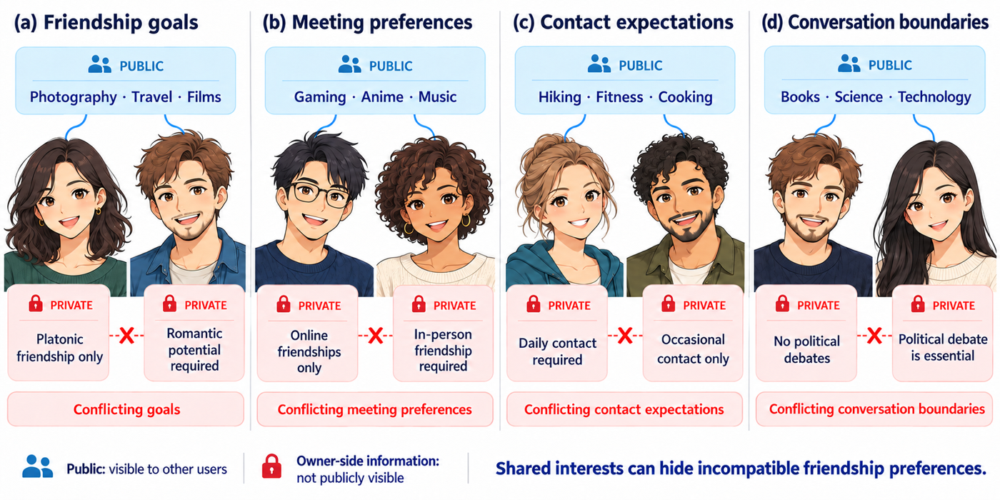
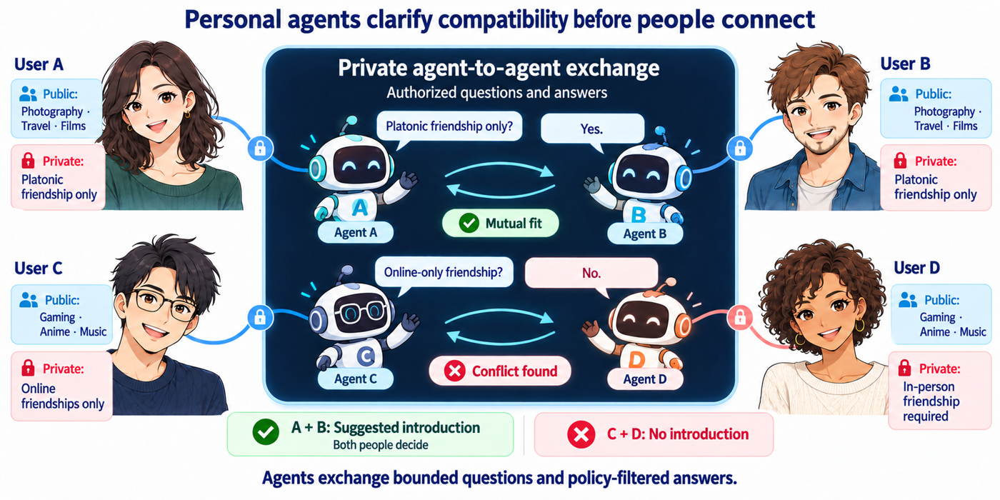

# Social Agent

**An LLM Agent Framework for Reciprocal Recommendation in Online Dating and Friendship**

Qiming Guo, Jinwen Tang, Xingran Huang, Hung-Yu Lin, Yafu Zhong, Xiatian Zhuang

> **Status: draft.** The paper is a working draft and will be updated as the experiments progress. This repository is updated with it.

Social Agent is an **agent framework design** for recommending people to people. Each person has a personal LLM agent that knows what its owner has written about themselves and what they require of a partner. Before anyone is introduced, the two agents exchange a few short questions about whatever the public profiles leave open. Each answer is computed from what the answering person wrote and agreed to share, each side decides by a fixed rule, and the two people are introduced only if both sides agree.

## Why

Two people can share every visible interest and still want incompatible things. The requirements that decide a match are often not in the public profile, and some of them are things people do not want to publish.



## How it works

Each agent works with its owner's own records and the other person's public profile; it never receives the other person's full record. The agents ask bounded questions about requirements the profiles leave open, the answers follow each owner's sharing settings, and an introduction is suggested only when both directions pass. The two people then decide.



## What is in this repository

The release comes in three parts.

| Part | Content | Where | Status |
|---|---|---|---|
| **1. Data and data generator** | The simulated community used in the paper (200 people, 240 requests, three activities), its documentation, the reference compatibility labels, and the generator that produced it. | [`paper_data/data/`](paper_data/data/) (data) and [`paper_data/src/social_agent/community/`](paper_data/src/social_agent/community/) (generator); described in [`paper_data/README.md`](paper_data/README.md), section 3 | available |
| **2. Experiment code for reproduction** | The framework's matching protocol, all baselines, the recorded runs behind every reported number, and the scoring that rebuilds every table and figure of the paper. | [`paper_data/`](paper_data/) | available |
| **3. Application back end** | Architecture and reference code of an Online Dating and Friendship LLM agent application built on the framework: an agent back end with an SQL database, two user clients (A and B) in which each person talks with their own agent, and a data-entry client (C). Described in a separate application paper. | [`app/`](app/) | coming in the future |

### Quick start (parts 1 and 2)

```bash
cd paper_data
pip install -e ".[dev]"      # Python 3.11 or 3.12
pytest -q                    # unit tests and reproduction of the paper's headline numbers
social-agent paper-results   # rebuilds every table and figure from the recorded runs; no GPU needed
```

Running the experiments again with real models needs a GPU and Ollama; see [`paper_data/README.md`](paper_data/README.md).

## Follow-up research

We welcome follow-up work on agent-based social recommendation, reciprocal recommendation, and online dating and friendship matching. You are free to use the data, the generator and the code (see the licenses below), extend the framework to new scenarios, or compare new methods on the same community. Issues and pull requests are welcome.

## Citation

If you use this framework, the data or the code, please cite the paper:

```bibtex
@misc{guo2026social,
  title  = {Social Agent: An {LLM} Agent Framework for Reciprocal Recommendation in Online Dating and Friendship},
  author = {Guo, Qiming and Tang, Jinwen and Huang, Xingran and Lin, Hung-Yu and Zhong, Yafu and Zhuang, Xiatian},
  year   = {2026},
  note   = {Draft},
  url    = {https://github.com/QM378/Social-Agent}
}
```

The entry will be updated with the arXiv identifier once the paper is posted. A machine-readable version is in [`CITATION.cff`](CITATION.cff).

## License

Code: MIT License (see [`LICENSE`](LICENSE)). Data and run records in `paper_data/data/` and `paper_data/records/`: CC BY 4.0 (see [`paper_data/data/LICENSE-DATA.md`](paper_data/data/LICENSE-DATA.md)). All people, profiles and requests in the data are synthetic.
